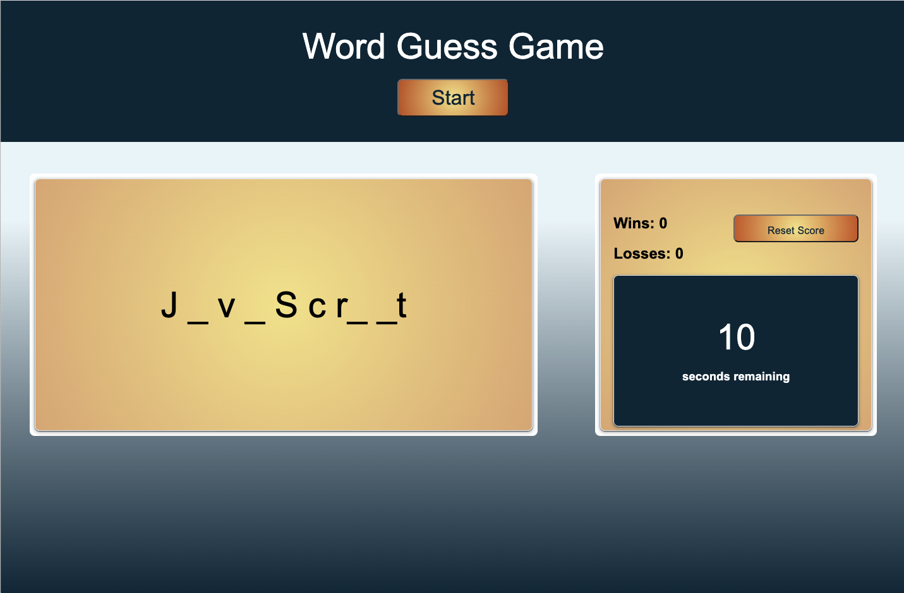

# <Word-Guess-Game>

# Word Guess

## Summery
This project is about a simple game web-page that using JavaScript and Web APIs.

## Built with

* Website crated With HTML language, JavaScript and Web APIs.
* Add custom styling with CSS framework.

* [HTML](https://developer.mozilla.org/en-US/docs/Web/HTML)
* [JavaScript](https://developer.mozilla.org/en-US/docs/Web/JavaScript)
* [CSS](https://developer.mozilla.org/en-US/docs/Web/CSS)
* [server-side APIs](https://coding-boot-camp.github.io/full-stack/apis/api-resources) 
(Note: Third-party APIs allow developers to access their data and functionality by making requests with specific parameters to a URL.)

Refer to the documentation:

* [MDN Web Docs on KeyboardEvent](https://developer.mozilla.org/en-US/docs/Web/API/KeyboardEvent)

* [MDN Web Docs on Array](https://developer.mozilla.org/en-US/docs/Web/JavaScript/Reference/Global_Objects/Array)

* [MDN Web Docs on loops and iteration](https://developer.mozilla.org/en-US/docs/Web/JavaScript/Guide/Loops_and_iteration)

* [MDN Web Docs on setInterval()](https://developer.mozilla.org/en-US/docs/Web/API/WindowOrWorkerGlobalScope/setInterval)

* [MDN Web Docs on clearInterval()](https://developer.mozilla.org/en-US/docs/Web/API/WindowOrWorkerGlobalScope/clearInterval)

* [MDN Web Docs on localStorage](https://developer.mozilla.org/en-US/docs/Web/API/Window/localStorage)

## Instructions

Application have following criteria:

* Start the game by clicking on a button. 

* Try and guess a word by filling in a number of blanks that match the number of letters in that word.

* The game be timed. 

* Will win the game when user have guessed all the letters in the word.

* Will lose the game when the timer runs out before user guessed all the letters.

* The total wins and losses on the screen also provided. 

## Link
You can experience the deployed project here: [Word Guess URL ](https://hadisparsa.github.io/Word-Guess-Game/).

## The following demo shows the web application's appearance and functionality:

